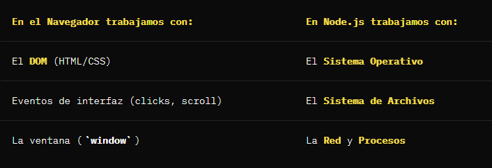
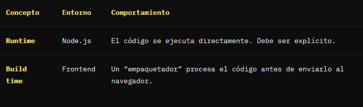

# ¿Qué es Node.js?
Node.js es un entorno de ejecución de JavaScript que permite ejecutar JavaScript en el servidor.

```cite
Importante: Node.js no es un nuevo lenguaje, es el mismo JavaScript que ya conoces, pero ejecutándose en un lugar diferente.
```

Esto es clave:
- No es un **lenguaje**
- No es una **librería**
- No es un **framework**
- Es un **entorno de ejecución**

El navegador ya puede ejecutar JS gracias a su motor interno. Node.js ejecuta JS en el servidor (sistema operativo).

# ¿Que hay por debajo de Node.js?

Node.js se basa en el motor V8 de Chrome.

Gracias a esto: 
- JS se ejecuta de forma extremadamente eficiente.
- El rendimiento es excelente para tareas de entrada/salida (I/O).
- Podemos reutilizar el **mismo lenguaje** en frontend y backend.

# Un modelo asíncrono y orientado a eventos
Una de las claves de Node.js es que es **asíncrono** y **orientado a eventos**.

```cite
Este modelo permite que Node.js sea capaz de manejar miles de conexiones simultáneas sin bloquearse, a diferencia de otros entornos tradicionales.
```

Esto lo hace ideal para operaciones como:
- **Acceso a red**: Peticiones HTTP, lectura de archivos, WebSockets, etc.
- **Operaciones de entrada/salida (I/O)**: Lectura/escritura de archivos, operaciones de base de datos, etc.
- **Procesamiento de datos**: Procesamiento de datos en memoria, cálculos complejos, etc.
- **APIs y servidores**: Procesamiento ligero de muchas peticiones.

# Node.js no es el navegador


En Node.js **no hay DOM**. No hay ventana. Hay sistema.


# Por qué Node.js es tan importante

Node.js está en el centro del ecosistema JavaScript, incluso aunque no te dediques al backend.

Lo utilizan a diario:

- Equipos frontend (React, Vue, Astro).
- Herramientas de desarrollo como Vite o Webpack.
- Runners de testing (Jest, Vitest).
- Bundlers y servidores de desarrollo.

# Casos de uso principales
Node.js brilla especialmente en tres escenarios:

- **Servidores y APIs**: Microservicios, APIs REST y comunicación en tiempo real.
- **Línea de comandos (CLI)**: Herramientas de terminal y utilidades para desarrolladores.
- **Scripts y automatizaciones**: Procesamiento de archivos y pipelines de CI/CD.
Conclusión
Node.js ha unificado el desarrollo web permitiendo que un solo lenguaje domine toda la aplicación. Es una pieza **fundamental, potente y versátil** que todo desarrollador JavaScript debe conocer.

En la siguiente clase empezaremos a ver ejemplos prácticos y construiremos nuestra **primera API**.


# Instalar Node.js y gestionar versiones
En esta clase vamos a ver cómo instalar Node.js correctamente y, más importante aún, cómo gestionar múltiples versiones sin romper proyectos ni volvernos locos.

Instalar Node.js no es solo descargar un instalador y darle a “siguiente”. Si quieres trabajar en equipo y en proyectos reales, hay una forma profesional de hacerlo.

## Dónde descargar Node.js
Si visitas la página oficial de Node.js, verás varias opciones de instalación según el sistema operativo:

- Windows (.msi)
- macOS (.pkg)
- Linux (binarios)

Aunque existe la opción de descargar un instalador clásico, esta no es la forma recomendada para trabajar en proyectos profesionales.

## ¿Por qué evitar el instalador clásico?
- Versión única: Te obliga a tener una sola versión de Node.js instalada globalmente.
- Dificultad de cambio: Cambiar de versión es complicado y requiere desinstalar e instalar de nuevo.
- Problemas en equipo: Diferentes proyectos pueden requerir versiones distintas.
- Conflictos: Proyectos antiguos pueden romperse si actualizas Node.js globalmente.

## La forma correcta: usar un gestor de versiones
La forma recomendada de instalar Node.js es usando un gestor de versiones. Un gestor te permite:

- ✅ Tener varias versiones de Node.js instaladas simultáneamente.
- ✅ Cambiar de versión en segundos.
- ✅ Usar una versión distinta según el proyecto.
- ✅ Evitar conflictos entre entornos.

## LTS vs Current: ¿Qué versión usar?
Antes de instalar nada, es vital entender las versiones disponibles:

- LTS (Long Term Support):
  - Versión estable y con soporte extendido.
  - Mayor compatibilidad con el ecosistema.
  - Recomendada para producción y el día a día.
- Current:
  - Versión más reciente con las últimas novedades.
  - Puede contener APIs experimentales.
  - Ideal para probar funciones nuevas, pero no para producción.

```cite
Consejo: Si tienes dudas, usa siempre la versión LTS.
```

## FNM: Fast Node Manager
Existen varios gestores de versiones populares como nvm, n, o mise. En esta clase usamos FNM (Fast Node Manager) porque:

- 🚀 Es extremadamente rápido (escrito en Rust).
- 💻 Es multiplataforma (funciona igual en macOS, Windows y Linux).
- 🛠️ Es sencillo de configurar y usar.

### Instalar FNM
Para instalar FNM, sigue las instrucciones de su repositorio oficial. Generalmente, basta con ejecutar un script en tu terminal.

Una vez instalado, recuerda:

- Reiniciar tu terminal (o abrir una nueva pestaña).
- Verificar que funciona ejecutando:

```bash
fnm --version
```

### Comandos esenciales de FNM
Aquí tienes los comandos que más utilizarás:

1. Instalar la versión LTS
No necesitas saber el número de versión, FNM lo busca por ti:

```bash
fnm install --lts
```

2. Listar versiones instaladas
Para ver qué versiones tienes en tu equipo y cuál estás usando:

```bash
fnm list
```

3. Cambiar de versión
Si necesitas una versión específica (por ejemplo, la 20):

```bash
fnm use 20
```
4. Establecer una versión por defecto
Para que cada nueva terminal use siempre una versión concreta:

```bash
fnm default 20
```
5. Desinstalar versiones antiguas
Mantén tu entorno limpio borrando lo que ya no usas:

```bash
fnm uninstall 18
```

### Para terminar…
Instalar Node.js de forma profesional es el primer paso para un flujo de trabajo sólido en el backend:

- Nunca dependas de instaladores manuales.
- Utiliza siempre un gestor de versiones (como fnm o nvm).
- Prioriza la versión LTS para tus proyectos.
¡Con esto ya tienes Node.js configurado correctamente y estamos listos para empezar con Express!

# Ficheros y sistema de módulos en Node.js
En esta clase damos el primer paso real trabajando con **Node.js**: crear archivos, ejecutarlos desde la terminal y entender cómo funciona su sistema de módulos, que es uno de los puntos donde más confusión suele haber al venir del frontend.

## Creando el primer fichero en Node.js
Partimos de una carpeta vacía. No hay configuración, no hay magia. Creamos nuestro primer archivo: index.js.

Dentro escribimos el clásico Hello World y lo ejecutamos desde la terminal:

```js
// index.js
console.log('¡Hola mundo desde Node.js!')
```
Ejecutamos en la terminal:

```bash
node index.js
```

Si vemos el mensaje por consola, ya sabemos dos cosas importantes:

- Node.js está correctamente instalado.
- Estamos usando la versión adecuada.

## Dividir el código en ficheros
Igual que en frontend, no queremos tener todo en un solo archivo. Vamos a separar la lógica. Por ejemplo, vamos a crear un archivo para funciones matemáticas.

1. Creamos math.js

```js
// math.js
export function sumar(a, b) {
  return a + b
}

export function restar(a, b) {
  return a - b
}
```

2. Intentamos usarlo en index.js

```js
// index.js
import { sumar } from './math'

console.log(sumar(5, 5))
```

### El error más común al importar módulos
Aunque el código parece correcto, Node.js lanzará un error diciendo que no encuentra el módulo si olvidas la extensión. **¿El motivo?**

En Node.js, **la extensión del fichero es obligatoria.**

```cite
**Nota importante:** En el frontend, gracias a herramientas como Vite o Webpack, la extensión suele ser opcional porque el empaquetador la busca por ti. En Node.js, en tiempo de ejecución (**runtime**), no lo es.
```

Si el archivo se llama math.js, tienes que importar explícitamente ./math.js. Node.js no pierde tiempo intentando “adivinar” si buscas un .js, .json o una carpeta; busca exactamente lo que le pides.

### Runtime vs Build time
Esta diferencia es fundamental para entender por qué Node.js es más estricto:



### ¿Y la advertencia?
Una vez solucionado el problema de añadir la extensión, Node.js nos mostrará una advertencia:

```cite
(node:12345) Warning: To load an ES module, set "type": "module" in the package.json or use the .mjs extension.
```

Esta advertencia nos indica que debemos configurar nuestro proyecto para usar ES Modules.

Según la versión que estés usando es posible que sea un error y el programa no se ejecute o sea simplemente una advertencia (aunque te dirá que puede haber problemas de rendimiento). ¿Por qué pasa esto?

Porque Node.js no usa ES Modules por defecto, sino que usa CommonJS.

## El pasado: CommonJS
Antes de que existiera un estándar oficial de módulos en JavaScript (ES Modules), Node.js creó su propio sistema llamado CommonJS. Todavía lo verás en muchos proyectos antiguos o librerías de npm.

```js
// math.js (Estilo antiguo)
function sumar(a, b) {
  return a + b
}

module.exports = { sumar }
```

```js
// index.js (Estilo antiguo)
const { sumar } = require('./math') // Aquí la extensión solía ser opcional
console.log(sumar(5, 5))
```

```cite
**¿Por qué no se recomienda hoy en día? **“CommonJS es un sistema síncrono y pensado originalmente para servidores, lo que lo hace incompatible con el estándar actual de la web. ES Modules es el estándar oficial de JavaScript, permite el ‘tree-shaking’ (eliminar código que no usas) y es compatible tanto con el navegador como con Node.js moderno.”
```

## El presente: ES Modules
Es el estándar que usamos hoy en día (import / export). Para que Node.js sepa que queremos usarlo, debemos configurar nuestro proyecto.

Configurando el tipo de módulo
Debemos crear un archivo package.json en la raíz de nuestro proyecto:

```json
// package.json
{
  "type": "module"
}
```

Con esta propiedad "type": "module", Node.js:

- Deja de mostrar advertencias.
- Activa el soporte completo para import y export.
- Nos permite usar el estándar moderno de la industria.

Entender el sistema de módulos es vital para no frustrarse con errores de “módulo no encontrado” o advertencias extrañas en la terminal.

- ✅ Ejecutamos con node nombre-archivo.js.
- ✅ La extensión .js es obligatoria en los imports de ES Modules.
- ✅ Usamos "type": "module" en el package.json para trabajar con la sintaxis moderna.


Sistema de permisos en Node.js
Cuando ejecutas un programa con Node.js, este tiene mucho más poder del que normalmente somos conscientes. Puede leer archivos, escribir en el sistema, acceder a la red y ejecutar procesos de forma prácticamente ilimitada.

En esta clase vamos a ver por qué esto puede ser un riesgo de seguridad y cómo activar y controlar el sistema de permisos experimental de Node.js para ejecutar programas de forma mucho más segura.

El problema: Node.js tiene acceso casi total al sistema
Por defecto, un script de Node.js tiene los mismos privilegios que el usuario que lo ejecuta. Esto significa que puede:

📂 Leer archivos sensibles del sistema (como claves SSH o configuraciones).
📝 Escribir archivos en cualquier carpeta donde el usuario tenga permiso.
🌐 Acceder a la red para enviar o recibir datos.
⚙️ Ejecutar procesos externos.
🔧 Modificar recursos del sistema operativo.
Todo esto ocurre sin que Node.js te pida confirmación. El único límite real es el sistema de permisos del sistema operativo. Si ejecutas Node como root o administrador, el riesgo es máximo.

Por qué esto puede ser peligroso
Un script malicioso (o una dependencia de terceros comprometida) podría:

Leer tus archivos privados.
Extraer información sensible y enviarla a un servidor externo.
Instalar malware o crear archivos que se ejecuten al iniciar el sistema.
El sistema de permisos de Node.js
A partir de Node.js v20, se introdujo un sistema de permisos experimental que permite restringir qué puede hacer un script. Este sistema se inspira en otros entornos como Deno y permite controlar:

Acceso al sistema de archivos (Lectura/Escritura).
Acceso a la red.
Ejecución de procesos hijos.
Uso de worker_threads.
💡 Nota: Al ser una característica experimental, todavía requiere un flag específico para activarse.

Cómo activar el modo de permisos
Para activar este sistema, debes ejecutar Node.js con el flag --experimental-permission.

node --experimental-permission index.js
Copiar
Al hacerlo, Node entra en un modo restringido donde no puede acceder a nada sin permiso explícito. Si tu script intenta leer un archivo sin haberle dado permiso previo, el proceso fallará inmediatamente con un error de acceso denegado.

Conceder permisos específicos
En lugar de dar “permiso para todo”, la clave es ser específico. Podemos usar flags adicionales para conceder accesos controlados.

Dar permisos de lectura (--allow-fs-read)
Puedes permitir la lectura de forma global (poco recomendado) o limitarla a archivos o carpetas específicas:

# Permitir lectura en todo el sistema (Peligroso)
node --experimental-permission --allow-fs-read="*" index.js

# Permitir lectura solo en una carpeta específica (Recomendado)
node --experimental-permission --allow-fs-read="/Users/proyecto/data/*" index.js
Copiar
Dar permisos de escritura (--allow-fs-write)
Lo mismo ocurre con la escritura. Puedes restringir dónde puede guardar archivos tu aplicación:

# Permitir escribir solo en la carpeta 'output'
node --experimental-permission --allow-fs-write="./output/*" index.js
Copiar
Si el script intenta escribir en /etc/hosts o en tu carpeta personal, Node bloqueará la operación.

Otros permisos importantes
Además de archivos, puedes controlar otros aspectos críticos:

--allow-net: Controla el acceso a la red (puedes especificar dominios o IPs).
--allow-child-process: Permite o deniega la ejecución de comandos del sistema.
--allow-worker: Controla si el script puede crear hilos secundarios.
Controlar permisos desde el propio código
Node.js también nos proporciona una API para comprobar en tiempo de ejecución si tenemos un permiso concreto. Esto es muy útil para mostrar errores amigables en lugar de dejar que la aplicación explote.

Usamos el objeto process.permission:

if (process.permission.has('fs.read', '/ruta/archivo.txt')) {
  console.log('✅ Tenemos permiso de lectura')
} else {
  console.error('❌ Error: No tenemos permiso para leer este archivo')
}
Copiar
Mejorar los mensajes de error
En lugar de recibir errores crípticos del sistema, detectar la falta de permisos nos permite:

Mostrar mensajes claros al usuario.
Ofrecer alternativas o instrucciones de configuración.
Tener un comportamiento más predecible y profesional.
Por qué esto es vital en el Backend
En el desarrollo de servidores y herramientas profesionales:

Ejecutas código que a menudo depende de cientos de librerías de terceros.
Procesas archivos subidos por usuarios externos.
Trabajas en entornos donde la seguridad es la prioridad número uno.
Implementar el principio de mínimo privilegio (dar solo los permisos estrictamente necesarios) reduce drásticamente la superficie de ataque de tu aplicación.

Conclusión
El sistema de permisos de Node.js es una herramienta poderosa que está cambiando cómo entendemos la seguridad en el ecosistema:

✅ Por defecto, Node.js tiene acceso casi total; activar el modo de permisos es un gran paso en seguridad.
✅ Es fundamental ser específico y restrictivo con lo que permitimos.
✅ Usar la API de permisos en el código ayuda a crear aplicaciones más robustas y con mejores mensajes de error.
Dominar estas herramientas te permitirá construir aplicaciones no solo funcionales, sino también seguras y preparadas para entornos de producción exigentes.